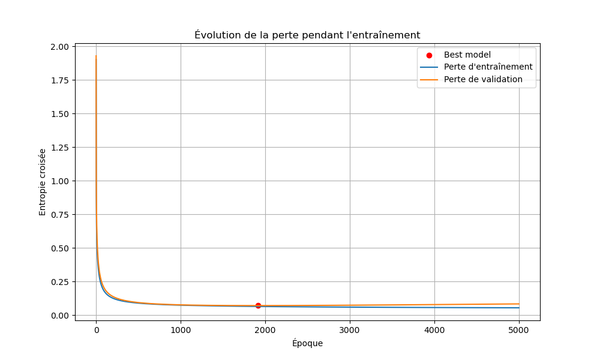
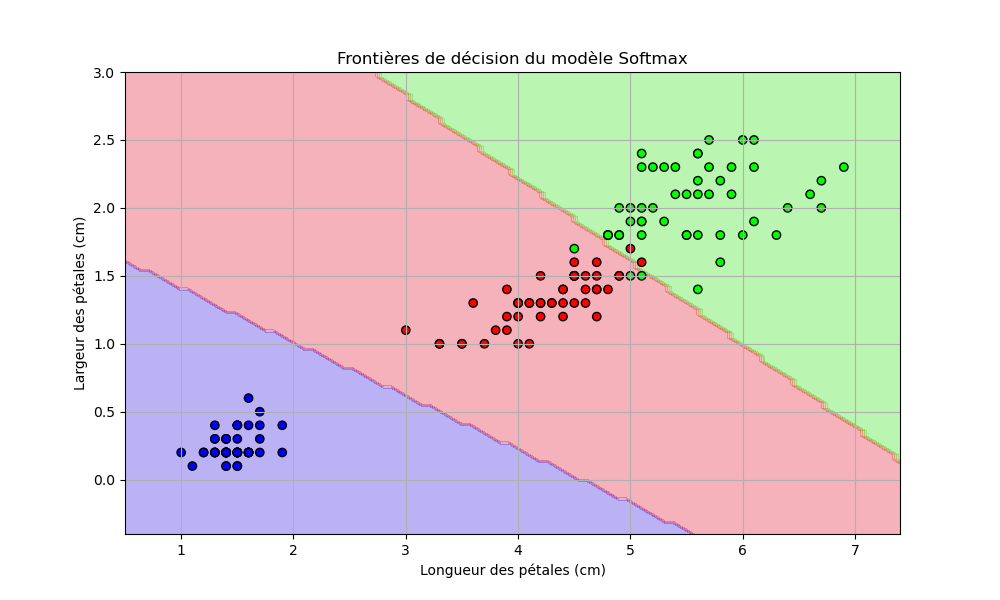

# Batch Gradient Descent with **early stopping for softmax regression**

## Core features:

*   **Zero ML Libraries:** Built entirely with `numpy`.
*   **Vectorization:** No Python `for` loops for calculations (relies on Matrix Multiplication `@`).
*   **Early Stopping:** Automatically saves the best model parameter $\theta$ when validation loss stops decreasing.
*   **Numerical Stability:** Softmax implementation includes the `max(logits)` subtraction trick.

## 1. Optimization Trajectory
*Tracking the Gradient Descent convergence with Early Stopping mechanism.*

## 2. Decision Boundaries (Iris Dataset)
*Visualizing how the model separates the 3 classes of flowers.*

### 1. Clone the repo
git clone https://github.com/YOUR_USERNAME/softmax-regression-scratch.git

### 2. Install dependencies 
pip install numpy matplotlib scikit-learn

### 3. Run the training
python main.py

